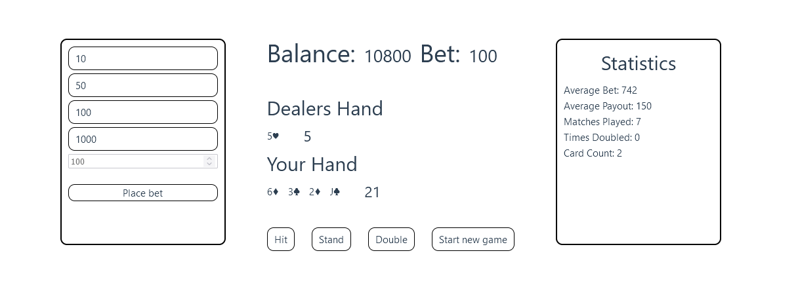

# 🎲 Blackjack Simulator 🃏



### 🚨 Disclaimer: 
This is a **personal project for fun and educational purposes only**. It is not intended to promote gambling in any form. Remember, in the real world, **the house always wins**. Play responsibly, and most importantly, **don't gamble with real money**!

---

## 🚀 Quick Start

This application is fully virtualized using Docker, so getting started is a breeze:

1. Clone this repository:
   ```git clone https://github.com/Flowwrian/blackjack-simulator.git```
3. Start the application with Docker Compose:
   ```docker compose up```
3. Open your browser and visit:
  http://localhost:8080

## 🛠️ About
This project is a full-stack application designed to showcase the seamless integration of modern web technologies. 
It features a Rust-based backend powered by Rocket.rs, responsible for simulating all game logic and handling HTTP requests. 
The frontend, developed with Vue.js, provides a simple and responsive interface for interacting with the backend.

This project is fully containerized using Docker, enabling consistent runtime environments and simplifying deployment.
